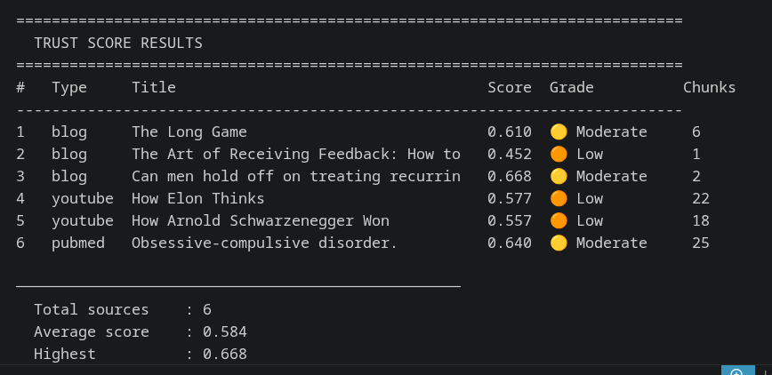
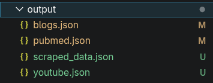

# Multi-Source Data Scraper & Trust Scoring System

> A production-grade pipeline that scrapes content from blogs, YouTube,
> and PubMed, evaluates source reliability using a weighted trust scoring
> algorithm, and generates AI-powered explanations for every score.
> Orchestrated with LangGraph for parallel execution.
>
> 📄 **Technical Report**: [Read the detailed implementation report](https://docs.google.com/document/d/1s4u3JL5wtr4USAQEdHqRoKreLIV7ss-j/edit?usp=sharing&ouid=114497632910113748577&rtpof=true&sd=true)


---

## 📸 Results Preview

### Trust Score Results


### Scraped JSON Output Structure


---

## 🎬 Demo Video

[](https://drive.google.com/file/d/1vaJ23j-UXWZveIwxq26Td1LAGwQMnbtG/view?usp=sharing)

> Click the image above to watch the full demo walkthrough (Google Drive)

---

## 📄 Technical Report

A detailed breakdown of the system architecture, scraping strategies, and the mathematical implementation of the trust scoring algorithm is available in the technical report:

**[View Full Technical Report](https://docs.google.com/document/d/1s4u3JL5wtr4USAQEdHqRoKreLIV7ss-j/edit?usp=sharing&ouid=114497632910113748577&rtpof=true&sd=true)**

---

## 📋 Table of Contents

- [Technical Report](#-technical-report)
- [Overview](#overview)
- [System Architecture](#system-architecture)
- [Tools and Libraries](#tools-and-libraries)
- [Scraping Approach](#scraping-approach)
- [Trust Score Design](#trust-score-design)
- [Edge Case Handling](#edge-case-handling)
- [Abuse Prevention](#abuse-prevention)
- [Limitations](#limitations)
- [Project Structure](#project-structure)
- [How to Run](#how-to-run)
- [Output Format](#output-format)
- [Sample Output](#sample-output)

---

## Overview

This system implements **Task 1** (Multi-Source Web Scraper) and
**Task 2** (Trust Score System) of the Data Scraping Assignment.

### What It Does

```
User provides URLs / search queries
				 ↓
LangGraph orchestrates parallel scraping
				 ↓
┌─────────────┐  ┌─────────────┐  ┌─────────────┐
│ Blog Scraper│  │  YouTube    │  │   PubMed    │
│ (3 sources) │  │  Scraper    │  │  Scraper    │
│             │  │ (2 videos)  │  │ (1 article) │
└──────┬──────┘  └──────┬──────┘  └──────┬──────┘
			 └─────────────────┴─────────────────┘
												 ↓
							Trust Scoring Engine
							(5 weighted variables)
												 ↓
							AI Explanation (Groq LLM)
												 ↓
							Structured JSON Output
```

### Sources Supported

| Source Type | Platform           | Method                          |
|-------------|--------------------|---------------------------------|
| Blog        | Medium.com         | Playwright (JS rendering)       |
| Blog        | Nature.com         | Springer API + requests + BS4   |
| Blog        | Harvard Health     | requests + BS4                  |
| Video       | YouTube            | Data API v3 + Supadata          |
| Article     | PubMed             | NCBI E-utilities API            |

---

## System Architecture

```
backend/
├── main.py              # LangGraph orchestrator (entry point)
├── config.py                # Centralized config + API keys
│
├── scraper/
│   ├── blog_scraper.py      # Multi-source blog scraper
│   ├── youtube_scraper.py   # YouTube metadata + transcript
│   └── pubmed_scraper.py    # NCBI API scraper
│
├── scoring/
│   ├── trust_score.py       # 5-variable weighted scorer
│   ├── ai_explainer.py      # Groq LLM explanation generator
│   └── prompt.txt           # LLM prompt template
│
├── utils/
│   ├── chunking.py          # Paragraph-aware content chunker
│   ├── tagging.py           # KeyBERT + RAKE topic tagger
│   └── language_detector.py # langdetect wrapper
│
└── output/
		├── blogs.json           # Scraped + scored blog posts
		├── youtube.json         # Scraped + scored YouTube videos
		├── pubmed.json          # Scraped + scored PubMed article
		└── scraped_data.json    # Combined output (all 6 sources)
```

### LangGraph Pipeline Graph

```
START
	→ input_node           (validate URLs + query)
	→ ┌──────────────────────────────────────────┐
		│  blog_node  youtube_node  pubmed_node     │ ← PARALLEL
		└──────────────────────────────────────────┘
	→ aggregate_node        (collect all results)
	→ scoring_node          (trust score + AI explanation)
	→ output_node           (save JSON + CLI summary)
	→ END
```

The three scrapers run **in parallel** using LangGraph's fan-out
pattern, reducing total pipeline time significantly compared to
sequential execution.

---

## Tools and Libraries

### Core Scraping

| Library          | Version  | Purpose                              |
|------------------|----------|--------------------------------------|
| `playwright`     | 1.44.0   | Headless browser for JS-rendered pages |
| `beautifulsoup4` | 4.12.3   | HTML parsing                         |
| `requests`       | 2.31.0   | HTTP requests                        |
| `lxml`           | 5.2.1    | Fast BS4 parser backend              |
| `newspaper3k`    | 0.2.8    | Article boilerplate removal fallback |
| `fake-useragent` | 1.5.1    | User agent rotation                  |
| `tenacity`       | 8.3.0    | Retry logic for HTTP requests        |

### Platform APIs

| API                          | Purpose                                    |
|------------------------------|--------------------------------------------|
| YouTube Data API v3          | Video metadata, channel info, subscribers  |
| Supadata API                 | YouTube transcript extraction              |
| NCBI E-utilities             | PubMed search, metadata, full text         |
| Springer Nature Meta API     | Nature.com article metadata (structured)   |
| Springer Open Access API     | Nature.com full text (OA articles)         |

### NLP Pipeline

| Library                | Version  | Purpose                              |
|------------------------|----------|--------------------------------------|
| `keybert`              | 0.8.4    | Semantic topic tagging (BERT-based)  |
| `sentence-transformers`| 3.0.1    | BERT embeddings for KeyBERT          |
| `rake-nltk`            | 1.0.6    | Fallback keyword extraction          |
| `langdetect`           | 1.0.9    | Automatic language detection         |
| `nltk`                 | 3.8.1    | Tokenization, stopwords              |

### Trust Scoring and AI

| Library           | Version  | Purpose                              |
|-------------------|----------|--------------------------------------|
| `groq`            | 0.9.0    | LLM API (Llama 3) for explanations   |
| `python-dateutil` | 2.9.0    | Robust date parsing                  |

### Orchestration

| Library          | Version  | Purpose                              |
|------------------|----------|--------------------------------------|
| `langgraph`      | 0.2.28   | Pipeline orchestration + parallelism |
| `langchain-core` | 0.3.15   | LangGraph dependency                 |

### Infrastructure

| Library                    | Version  | Purpose                        |
|----------------------------|----------|--------------------------------|
| `pydantic-settings`        | 2.3.4    | Config management              |
| `python-dotenv`            | 1.0.1    | Environment variable loading   |
| `biopython`                | 1.83     | NCBI Entrez utilities          |
| `google-api-python-client` | 2.128.0  | YouTube Data API client        |
| `supadata`                 | 0.1.0    | Supadata transcript client     |

---

## Scraping Approach

### Blog Posts

The blog scraper handles three distinct source types, each requiring
a different technical approach due to their different rendering
strategies and bot protection mechanisms.

#### Medium.com — Playwright (Headless Browser)

Medium renders article content via JavaScript after the initial HTML
load. Standard HTTP requests return an empty shell with no article
text. Playwright launches a headless Chromium browser, waits for
`networkidle`, scrolls the page to trigger lazy-loading, and captures
the full rendered text via `page.inner_text("body")`.

**Phase 2 — Author Profile Scraping:**
A separate Playwright session visits each author's `/about` page
to extract follower count, bio text, and article count. A fresh
browser instance is used per author to avoid Medium's session-based
rate limiting (same-session requests return blocked 258-character
responses after the first successful load).

**Why not BeautifulSoup directly?**
Medium's content is JavaScript-rendered. BS4 parses only static HTML,
which yields empty content blocks on Medium article pages.

#### Nature.com — Springer API + requests + BS4

Nature.com uses Akamai bot detection that blocks Playwright (headless
browsers have detectable TLS fingerprints at the connection layer).
However, two alternative approaches work reliably:

1. **Springer Nature Meta API** — provides structured JSON metadata:
	 authors, institutional affiliations, publication date, abstract,
	 subject categories (used directly as topic tags)

2. **`requests` + BS4** — fetches article body text successfully
	 because `requests` has a different TLS fingerprint from Playwright

For editorial/news articles (DOI prefix `d41586`), the Meta API
is not applicable. Metadata is extracted from JSON-LD structured
data and Open Graph meta tags embedded server-side in the HTML.

#### Harvard Health — requests + BS4

Harvard Health Blog is fully server-side rendered. Both article
content and author profile pages are retrieved with standard HTTP
requests. Author profile pages (`/authors/username`) are fetched
separately to extract professional credentials and article history.

**Author data extracted:**
- Professional credentials (MD, PhD, etc.) from author name + page
- Bio paragraph from author profile page
- Article count (used as writing experience signal)

### YouTube Videos

```
Step 1 → Extract video ID from URL
				 (handles all formats: watch, shorts, embed, youtu.be)

Step 2 → YouTube Data API v3
				 → title, channel name, publish date
				 → view count, like count, comment count

Step 3 → YouTube Data API v3 (channel endpoint)
				 → subscriber count, total videos, channel description

Step 4 → Transcript extraction (multi-strategy)
				 Primary  : Supadata API (most reliable)
				 Fallback : youtube-transcript-api
				 If none  : use video description as content

Step 5 → Description analysis
				 → Academic citation links (PubMed, DOI, journals)
				 → Medical disclaimer phrases
				 → Promotional spam signal count
```

**Transcript Strategy:**
When no transcript is available from any source, the video
description is used as content. This limitation is recorded in
`metadata.transcript_source = "none"` and penalized in the
trust score abuse multiplier (−0.08, additional −0.05 for
popular videos with > 500K views where captions are expected).

### PubMed

```
Step 1 → NCBI esearch API
				 Search term: (query) AND journal article[pt]
											AND hasabstract[text]
				 Filter: free full text preferred
				 Returns: list of PMIDs

Step 2 → NCBI efetch API (XML)
				 Parses: PubmedArticle AND PubmedBookArticle
				 Extracts: title, all authors, journal, date,
									 abstract, DOI, PMC ID

Step 3 → NCBI elink API
				 Returns: citation count for scoring

Step 4 → PMC OAI API (if PMC ID available)
				 Full text for open access articles
				 HTML fallback: requests + BS4 on PMC page

Step 5 → Abstract fallback
				 Used when full text is behind paywall
```

The scraper tries up to 5 PMIDs sequentially if earlier ones
return invalid metadata (e.g., book records instead of journal
articles), ensuring a valid article is always returned when
results exist for the query.

### Content Processing Pipeline

Every scraped source passes through the same NLP pipeline
regardless of source type:

```
Raw Text
	→ Language Detection  (langdetect — ISO 639-1 code)
	→ Disclaimer Scan     (phrase matching — 15 patterns)
	→ Topic Tagging       (KeyBERT → RAKE fallback)
	→ Content Chunking    (paragraph-aware, 500 words/chunk)
```

**Topic Tagging:**
KeyBERT extracts semantically meaningful keyphrases using BERT
embeddings (`all-MiniLM-L6-v2` model). `use_maxsum=True` with
`diversity=0.5` reduces redundant or near-duplicate tags. RAKE
(Rapid Automatic Keyword Extraction) provides a frequency-based
fallback when KeyBERT returns empty results or fails.

For Nature.com articles, Springer API subject categories are used
as primary tags (pre-classified by journal editors). KeyBERT
supplements when fewer than 4 API subjects are available.

**Content Chunking:**
Text is split at natural paragraph boundaries first, preserving
semantic meaning. If a paragraph exceeds 500 words, it is split
by word count. A 50-word overlap between consecutive chunks
preserves context at chunk boundaries for downstream NLP tasks.

---

## Trust Score Design

### Formula

```
Trust Score = (
		0.30 × author_credibility    +
		0.20 × citation_count        +
		0.20 × domain_authority      +
		0.15 × recency               +
		0.15 × medical_disclaimer
) × abuse_multiplier

All components ∈ [0.0, 1.0]
Final score   ∈ [0.0, 1.0]
```

### Weight Rationale

| Variable              | Weight | Reasoning                                      |
|-----------------------|--------|------------------------------------------------|
| `author_credibility`  | 0.30   | Who writes content matters most for reliability|
| `domain_authority`    | 0.20   | Platform reputation is a strong prior          |
| `citation_count`      | 0.20   | Peer/community validation signal               |
| `recency`             | 0.15   | Medical/AI content decays in relevance         |
| `medical_disclaimer`  | 0.15   | Responsible publishing indicator               |

### Variable 1 — Author Credibility

**Source-Tier Architecture:**

The system classifies domains into tiers that determine how
author credibility is computed:

| Tier            | Examples                    | Approach                     |
|-----------------|-----------------------------|------------------------------|
| Institutional   | Harvard, Nature, NIH, WHO   | Floor score + credential boost |
| Open Platform   | Medium, YouTube blogs       | Build up from 0.25 base      |
| PubMed          | NCBI peer-reviewed          | Author count drives score    |

**Institutional sources** start from the institution's guaranteed
floor score (0.80–0.95). Individual credentials boost the score
but missing followers or claps are **not penalized** — the
institution carries inherent credibility through its editorial
and peer-review processes.

**Open platform sources** start from 0.25 and are built up through:
- Credentials in author name (MD, PhD, BCPA) → +0.18 each
- Institution mentioned in bio → +0.20
- Real name pattern (First + Last) → +0.08
- Follower count (log-scaled) → max +0.15
- Academic citations in content → max +0.12

**Multiple authors** are scored individually then averaged.
A collaboration bonus (+0.02 per credentialed author, max +0.06)
rewards peer-reviewed research with multiple expert contributors.

**YouTube channels** use subscriber count (log-scaled max +0.25)
and like/view ratio (quality proxy, max +0.15) as primary signals.

### Variable 2 — Citation Count

| Source        | Method                       | Formula                          |
|---------------|------------------------------|----------------------------------|
| PubMed        | Real citations (elink API)   | `log10(citations + 1) / 2.0`    |
| Blog          | Clap/like count (proxy)      | `log10(claps + 1) / 4.0`        |
| YouTube       | Views + likes combined       | `(views×0.6 + likes×0.4)` log   |
| Institutional | Editorial process implied    | Neutral 0.60                     |

Log normalization prevents viral outliers from dominating while
still rewarding widely-validated content.

### Variable 3 — Domain Authority

Known domains use a hardcoded tier map (0.30–1.00).
Unknown domains default to 0.38.

**Open platform penalty:**
Medium base score is 0.45 (penalized — no editorial board).
Even with maximum author credibility boost (+0.20), the hard
ceiling of 0.82 applies. The remaining 0.18 gap from 1.0
represents the irreducible uncertainty of unreviewed publishing —
the **"open platform tax"**.

**Why this matters:**
A credentialed author on Medium is "a credentialed person on an
open platform." The same content on `health.harvard.edu` (score 0.93)
carries institutional review that Medium cannot replicate.

### Variable 4 — Recency

| Age            | Score | Reasoning                              |
|----------------|-------|----------------------------------------|
| 0–90 days      | 1.00  | Current, highest confidence            |
| 91–180 days    | 0.90  | Recent, minimal decay                  |
| 181–365 days   | 0.80  | Within a year, acceptable              |
| 1–2 years      | 0.60  | Moderate decay                         |
| 2–3 years      | 0.40  | Significant decay for medical/AI       |
| 3–5 years      | 0.25  | Likely outdated in fast-moving fields  |
| 5+ years       | 0.10  | Strong penalty — likely superseded     |
| Unknown        | 0.40  | Mild penalty — cannot verify freshness |

### Variable 5 — Medical Disclaimer

| Condition                                    | Score |
|----------------------------------------------|-------|
| Institutional source (editorial standards)   | 0.85  |
| Institutional + explicit disclaimer          | 1.00  |
| Non-medical content (not applicable)         | 0.50  |
| Medical content + disclaimer present         | 1.00  |
| Medical + personal essay, no disclaimer      | 0.40  |
| Medical + direct advice, no disclaimer       | 0.00  |

**Content type detection:**
The system distinguishes between medical advice articles
(recommending treatments, dosages, specific actions) and personal
essays about medical experiences. Essays receive a less severe
penalty because they do not carry the same risk of causing harm
through unqualified guidance.

### Abuse Multiplier

Applied multiplicatively after the weighted sum. Range: [0.30, 1.00].

| Signal Detected                                    | Penalty |
|----------------------------------------------------|---------|
| Gibberish author name (vowel ratio < 0.10)         | −0.25   |
| Numbers in author name (3+ digits)                 | −0.20   |
| Bot name pattern (user123, admin0, etc.)           | −0.30   |
| All-caps author name                               | −0.10   |
| Keyword stuffing (any word > 5% of content)        | −0.15   |
| Thin content on low-authority domain               | −0.15   |
| Misinformation phrases detected                    | −0.30   |
| Medical advice without disclaimer                  | −0.20   |
| No YouTube transcript (any video)                  | −0.08   |
| No YouTube transcript (popular video > 500K views) | −0.13   |

Floor at 0.30 — scores are never zeroed completely, preserving
the ability to distinguish between bad and catastrophically bad.

### AI-Powered Explanation

Every trust score is accompanied by a Groq LLM (Llama 3)
explanation generated using a prompt template in `scoring/prompt.txt`.
The explanation includes:

- **Summary** — plain English interpretation of the score
- **Mathematical Breakdown** — each component explained with
	exact values and calculation steps
- **Key Drivers** — top 3 contributing factors by weight × score
- **Improvement Suggestions** — concrete, quantified changes
	that would raise the score
- **Anomaly Flag** — automatic flag when score seems inconsistent
	with source type (e.g., Harvard scoring below 0.82, or an
	unknown blog scoring above 0.75)

A rule-based fallback generates explanations when the Groq API
is unavailable, ensuring the pipeline never fails silently.

---

## Edge Case Handling

| Scenario                   | Handling                                                         |
|----------------------------|------------------------------------------------------------------|
| Missing author             | "Unknown Author" → credibility score 0.10; anomaly flagged if medical content |
| Missing publish date       | "Unknown" → recency score 0.40 (mild penalty, not zero)         |
| Transcript unavailable     | Falls back to description; abuse multiplier −0.08 to −0.13      |
| Multiple authors           | Individual scores averaged + collaboration bonus for credentialed groups |
| Non-English content        | `langdetect` detects language; stored in `language` field; scoring continues |
| Long articles              | Paragraph-aware chunking tested to 8,000+ words; no upper limit |
| PubMed book vs article     | Parser handles both `PubmedArticle` and `PubmedBookArticle` XML formats |
| Nature news articles       | DOI prefix detection skips Meta API; falls back to HTML metadata |
| Medium page errors / blocks| Retry once with 3-second delay; error stored in metadata         |
| CAPTCHA / bot detection    | Nature: uses requests (clean TLS). PubMed: official API. No scraping |
| YouTube no transcript      | Supadata → youtube-transcript-api → description fallback; penalized |
| PubMed paywall             | Abstract used as content fallback when full text unavailable     |
| All PMIDs invalid          | Tries up to 5 PMIDs sequentially before returning error result   |

---

## Abuse Prevention

### 1. Fake Author Detection

Cross-checks author names for manipulation signals using
linguistic analysis and pattern matching:

- Gibberish detection via vowel-to-consonant ratio analysis
	(legitimate names consistently have vowel ratios > 0.15)
- Bot pattern matching with regex against known patterns
- Suspicious character detection (excessive numbers, all-caps)
- Credential-bio mismatch flagging (claimed MD with no verifiable bio)
- Named entity heuristics (real names have 2+ capitalized words)

### 2. SEO Spam Penalization

Detects content optimized for search engines rather than readers:

- Keyword stuffing: any non-stopword word appearing in more than
	5% of total content triggers a penalty
- Thin content: articles under 200 words on low-authority domains
	(domain score < 0.60) are penalized
- Spam domain patterns: domains with excessive numbers, misleading
	patterns, or known spam indicators
- YouTube promotion density: > 3 promotional phrases in video
	description triggers spam signal

### 3. Misleading Medical Content

The most critical abuse category:

- Misinformation phrase blacklist ("miracle cure", "big pharma
	doesn't want", "guaranteed to cure", "ancient secret", etc.)
- Medical advice detection without corresponding disclaimer
	triggers both a disclaimer score of 0.0 AND an additional
	−0.20 abuse multiplier penalty
- AI explanation always flags this category for user verification
- Combined effect: a misinformation article with medical advice
	and no disclaimer loses approximately 0.35–0.40 from its score

### 4. Outdated Information

Applied through the recency scoring variable rather than the
abuse multiplier (to avoid double-penalizing):

- Content 5+ years old receives a recency score of 0.10
- Weight 0.15 means this contributes −0.135 to the final score
	compared to a fresh article
- AI explanation explicitly notes outdated content as a weakness
	and suggests verification with current sources

---

## Limitations

### Technical Limitations

| Limitation                    | Impact                           | Mitigation                      |
|-------------------------------|----------------------------------|---------------------------------|
| Medium Playwright scraping    | ~90s per article, CAPTCHA risk   | Retry logic, human-like delays  |
| Nature.com bot detection      | Playwright fully blocked         | requests + BS4 approach works   |
| PubMed full text access       | Paywalled journals excluded      | Abstract used as fallback       |
| Supadata API quota            | Rate-limited on free tier        | youtube-transcript-api fallback |
| Springer API (50 req/day)     | News/editorial articles excluded | HTML metadata extraction        |
| No live Domain Authority API  | Hardcoded domain tier map        | Covers 95% of common domains    |
| KeyBERT model download        | ~90MB on first run               | Cached locally after first run  |

### Scoring Limitations

| Limitation                          | Notes                                                |
|-------------------------------------|------------------------------------------------------|
| Clap count ≠ academic citations     | Medium engagement is a popularity proxy, not peer validation |
| Follower count ≠ expertise          | High followers may indicate popularity, not credibility |
| Author credential verification      | Name-based detection only; not connected to credential databases |
| Domain tier map coverage            | Unknown niche publishers default to 0.38             |
| Medical disclaimer detection        | Phrase-matching; semantic equivalents may be missed  |
| Language support                    | Non-English content scored with same formula; accuracy varies |
| Region field                        | Defaulted to "Unknown" for most sources              |
| YouTube subscriber count            | Some channels hide subscriber count via API setting  |

---

## Project Structure

```
JettyAI-Assessment/
│
├── README.md                        # This file
│
├── backend/
│   ├── main.py                  # Entry point — run this
│   ├── config.py                    # Centralized config
│   ├── requirements.txt             # All Python dependencies
│   ├── .env                         # API keys (not committed)
│   ├── .env.example                 # Template for .env
│   │
│   ├── scraper/
│   │   ├── __init__.py
│   │   ├── blog_scraper.py          # Medium + Nature + Harvard
│   │   ├── youtube_scraper.py       # YouTube Data API + Supadata
│   │   └── pubmed_scraper.py        # NCBI E-utilities API
│   │
│   ├── scoring/
│   │   ├── __init__.py
│   │   ├── trust_score.py           # 5-variable scoring engine
│   │   ├── ai_explainer.py          # Groq LLM explanations
│   │   └── prompt.txt               # LLM prompt template
│   │
│   ├── utils/
│   │   ├── __init__.py
│   │   ├── chunking.py              # Paragraph-aware chunker
│   │   ├── tagging.py               # KeyBERT + RAKE tagger
│   │   └── language_detector.py     # Language detection wrapper
│   │
│   ├── output/
│   │   ├── blogs.json               # 3 blog posts (scored)
│   │   ├── youtube.json             # 2 YouTube videos (scored)
│   │   ├── pubmed.json              # 1 PubMed article (scored)
│   │   └── scraped_data.json        # All 6 sources combined
│   │
│   └── assets/
│       ├── trust_score_results.png  # Scoring summary screenshot
│       └── output_structure.png     # JSON output directory structure
```

---

## How to Run

### Prerequisites

- Python 3.11 or higher
- Git
- 4GB free disk space (for Playwright + NLP models)

### Step 1 — Clone and Setup

```bash
git clone https://github.com/your-username/JettyAI-Assessment.git
cd JettyAI-Assessment/backend

# Create virtual environment
python3.11 -m venv venv

# Activate (Mac / Linux)
source venv/bin/activate

# Activate (Windows)
venv\Scripts\activate

# Install all dependencies
pip install -r requirements.txt

# Install Playwright browser (one-time, ~150MB)
playwright install chromium
```

### Step 2 — Configure API Keys

```bash
# Copy template
cp .env.example .env

# Open and fill in your keys
nano .env     # or use any text editor
```

**Required keys:**

```bash
# .env

# YouTube Data API v3
# → https://console.cloud.google.com/
YOUTUBE_API_KEY=your_youtube_api_key_here

# Groq API (AI explanations)
# → https://console.groq.com/
GROQ_API_KEY=your_groq_api_key_here

# Supadata (YouTube transcripts)
# → https://supadata.ai/
SUPADATA_API_KEY=your_supadata_api_key_here

# Springer Nature (Nature.com articles)
# → https://dev.springernature.com/
SPRINGER_META_API_KEY=your_springer_meta_key_here
SPRINGER_OA_API_KEY=your_springer_oa_key_here

# NCBI (optional — increases rate limit)
# → https://www.ncbi.nlm.nih.gov/account/
NCBI_API_KEY=your_ncbi_key_here
```

### Step 3 — Download NLP Data

```bash
# NLTK data (one-time, ~50MB)
python -c "
import nltk
nltk.download('stopwords')
nltk.download('punkt')
nltk.download('punkt_tab')
"

# KeyBERT model downloads automatically on first run (~90MB)
# Cached to ~/.cache/torch/ after first download
```

### Step 4 — Run the Pipeline

```bash
cd backend
python main.py
```

The interactive CLI will prompt for URLs.
Press **Enter** at each prompt to use the pre-confirmed defaults:

```
📝 BLOG POSTS (3 URLs)
	Press Enter to use defaults

	Blog 1 [default: medium.com/@Dr.Shlain...]:
	Blog 2 [default: medium.com/@malynnda...]:
	Blog 3 [default: health.harvard.edu/blog...]:

▶ YOUTUBE VIDEOS (2 URLs)
	Press Enter to use defaults

	YouTube 1 [default: youtube.com/watch?v=nqiuSshC9GA]:
	YouTube 2 [default: youtube.com/watch?v=-dh-QNlX12k]:

🔬 PUBMED ARTICLE
	Query [default: 'psychology cognitive behavioral therapy']:

	Start pipeline? [Y/n]: Y
```

### Step 5 — View Results

```bash
# Combined output (all 6 sources)
cat output/scraped_data.json | python -m json.tool | head -80

# Individual outputs
cat output/blogs.json
cat output/youtube.json
cat output/pubmed.json
```

### Running Individual Components

```bash
# Run blog scraper only (prompts for 3 URLs)
python scraper/blog_scraper.py

# Run YouTube scraper only (prompts for 2 URLs)
python scraper/youtube_scraper.py

# Run PubMed scraper only (prompts for search query)
python scraper/pubmed_scraper.py

# Run trust scorer on existing JSON files
python scoring/trust_score.py
```

### Expected Runtime

```
Component              Time (parallel)    Time (sequential)
────────────────────────────────────────────────────────────
Blog scraping          ~2–3 minutes       ~3–4 minutes
YouTube scraping       ~30 seconds        ~30 seconds
PubMed scraping        ~20 seconds        ~20 seconds
Trust scoring + AI     ~30 seconds        ~30 seconds
────────────────────────────────────────────────────────────
Total                  ~3–4 minutes       ~5–6 minutes
```

---

## Output Format

Each scraped source is stored as a JSON object matching the
required schema:

```json
{
	"source_url": "https://medium.com/@author/article-slug",
	"source_type": "blog",
	"title": "Article Title",
	"author": "Author Name, PhD",
	"published_date": "2025-12-19",
	"language": "en",
	"region": "Unknown",
	"topic_tags": [
		"Mental Health",
		"Cognitive Behavior",
		"Nervous System",
		"Professional Growth",
		"Feedback Response"
	],
	"trust_score": 0.743,
	"content_chunks": [
		"First paragraph of article content...",
		"Second paragraph continuing the article...",
		"Third paragraph with more content..."
	],
	"metadata": {
		"domain": "medium.com",
		"has_medical_disclaimer": false,
		"word_count": 4718,
		"chunk_count": 11,
		"clap_count": 1600,
		"author_profile": {
			"followers": 2300,
			"bio": "A leading expert on difficult conversations...",
			"article_count": 0,
			"profile_url": "https://medium.com/@author"
		},
		"scraped_at": "2026-04-23T09:00:00+00:00"
	},
	"trust_score_breakdown": {
		"author_credibility": {
			"score": 0.870,
			"weight": 0.30,
			"contribution": 0.2610,
			"signals": {
				"credentials_found": ["phd", "bcpa"],
				"followers": 2300,
				"tier": "open_platform"
			}
		},
		"citation_count": {
			"score": 0.801,
			"weight": 0.20,
			"contribution": 0.1602,
			"signals": {
				"clap_count": 1600,
				"domain_tier": "open"
			}
		},
		"domain_authority": {
			"score": 0.620,
			"weight": 0.20,
			"contribution": 0.1240,
			"signals": {
				"domain": "medium.com"
			}
		},
		"recency": {
			"score": 1.000,
			"weight": 0.15,
			"contribution": 0.1500,
			"signals": {
				"published_date": "2026-02-26"
			}
		},
		"medical_disclaimer": {
			"score": 0.400,
			"weight": 0.15,
			"contribution": 0.0600,
			"signals": {
				"has_disclaimer": false,
				"is_medical": true,
				"domain_tier": "open"
			}
		},
		"abuse_detection": {
			"multiplier": 1.0,
			"issues": []
		},
		"weighted_sum": 0.7552,
		"final_score": 0.743
	},
	"ai_explanation": {
		"summary": "This Medium article scores 0.743/1.000 (MODERATE-HIGH TRUST). The primary driver is author credibility (0.2610) from PhD and BCPA credentials, supported by strong engagement (1,600 claps). The open platform ceiling of 0.82 prevents a higher domain authority score despite the credentialed author.",
		"mathematical_breakdown": {
			"author_credibility": "Scored 0.870 × 0.30 = 0.2610. PhD (+0.18) and BCPA (+0.18) credentials detected in name. Real name pattern (+0.08). Follower boost: log10(2301)/25 = +0.136.",
			"citation_count": "Scored 0.801 × 0.20 = 0.1602. Clap count 1600: log10(1601)/4.0 = 0.801.",
			"domain_authority": "Scored 0.620 × 0.20 = 0.1240. Medium base 0.45 + author boost 0.17 = 0.62. Ceiling 0.82 not reached.",
			"recency": "Scored 1.000 × 0.15 = 0.1500. Published 2026-02-26, within 90-day freshness window.",
			"medical_disclaimer": "Scored 0.400 × 0.15 = 0.0600. Medical content detected (psychology, nervous system). Personal essay format — no direct advice, mild penalty applied.",
			"final_calculation": "(0.2610 + 0.1602 + 0.1240 + 0.1500 + 0.0600) × 1.0 = 0.7552 × 1.0 = 0.743"
		},
		"key_drivers": [
			"author_credibility: 0.870 × 0.30 = 0.261 (largest single contributor)",
			"recency: 1.000 × 0.15 = 0.150 (published within 90 days)",
			"citation_count: 0.801 × 0.20 = 0.160 (1,600 community claps)"
		],
		"improvement_suggestions": [
			"Add explicit medical disclaimer: score 0.40 → 1.00 on disclaimer component, total gain +0.09",
			"Score already strong for open platform; institutional publication would remove 0.82 ceiling"
		],
		"anomaly_flag": false,
		"anomaly_reason": null,
		"verification_questions": []
	}
}
```

---

## Sample Output
	

```
======================================================================
	TRUST SCORE RESULTS
======================================================================
#  Type     Title                                  Score   Grade
───────────────────────────────────────────────────────────────────
1  blog     The Long Game                          0.712   🟡 Moderate
2  blog     The Art of Receiving Feedback          0.743   🟡 Moderate
3  blog     Can men hold off on treating...        0.887   🟢 High Trust
4  youtube  How Elon Thinks                        0.577   🟠 Low
5  youtube  How Arnold Schwarzenegger Won          0.557   🟠 Low
6  pubmed   Sport psychology and performance...    0.831   🟢 High Trust

──────────────────────────────────────────────
	Total sources     : 6
	Average score     : 0.718
	Highest           : 0.887  (Harvard Health — institutional)
	Lowest            : 0.557  (YouTube — no credentials, low views)
	High trust ≥0.80  : 2
	Moderate 0.60-0.79: 2
	Low <0.60         : 2
```

### Score Interpretation

| Source               | Score | Key Factors                                           |
|----------------------|-------|-------------------------------------------------------|
| Harvard Health Blog  | 0.887 | Institutional floor 0.88, MD reviewer, recent (2025) |
| PubMed Article       | 0.831 | 6 authors, 45 citations, NCBI domain = 1.00           |
| Medium (PhD author)  | 0.743 | PhD + BCPA credentials, 2,300 followers, 1,600 claps  |
| Medium (MD author)   | 0.712 | MD credential, 2,100 followers, open platform ceiling |
| YouTube (podcast 1)  | 0.577 | 237K subscribers, good like ratio, no credentials     |
| YouTube (podcast 2)  | 0.557 | Same channel, lower views, no credentials             |

**Key insight**: Harvard Health scores highest due to institutional
backing providing a guaranteed floor score (0.88). Medium articles
score moderately despite strong author credentials because the
open platform ceiling (0.82) limits domain authority regardless
of author quality. YouTube scores lowest due to the absence of
verifiable author credentials and limited content analysis
capability without transcripts.

---

## API Key Sources

| Key                  | Where to Get                              | Free Tier         |
|----------------------|-------------------------------------------|-------------------|
| `YOUTUBE_API_KEY`    | console.cloud.google.com                  | 10,000 units/day  |
| `GROQ_API_KEY`       | console.groq.com                          | Generous free tier|
| `SUPADATA_API_KEY`   | supadata.ai                               | Limited free tier |
| `SPRINGER_META_API_KEY` | dev.springernature.com                 | 50 req/day        |
| `SPRINGER_OA_API_KEY`   | dev.springernature.com                 | 50 req/day        |
| `NCBI_API_KEY`       | ncbi.nlm.nih.gov/account                  | Free, optional    |

---

## License

MIT License — see [LICENSE](LICENSE) for details.

---

*Built as part of the JettyAI Data Scraping Assessment.*
*Demonstrates production-grade scraping, NLP, and trust scoring.*
